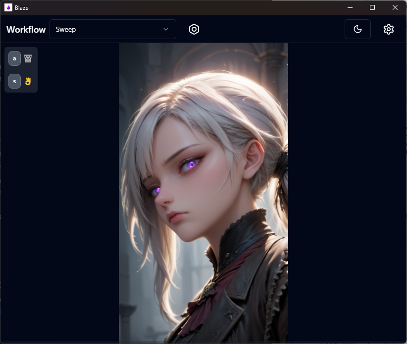
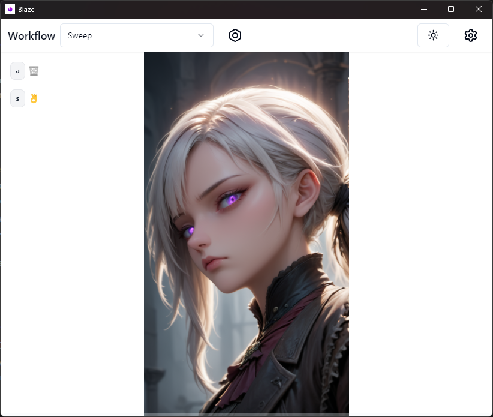
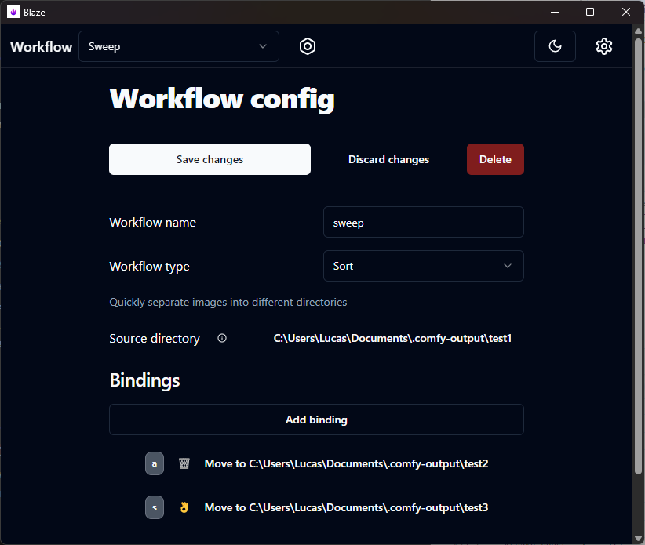
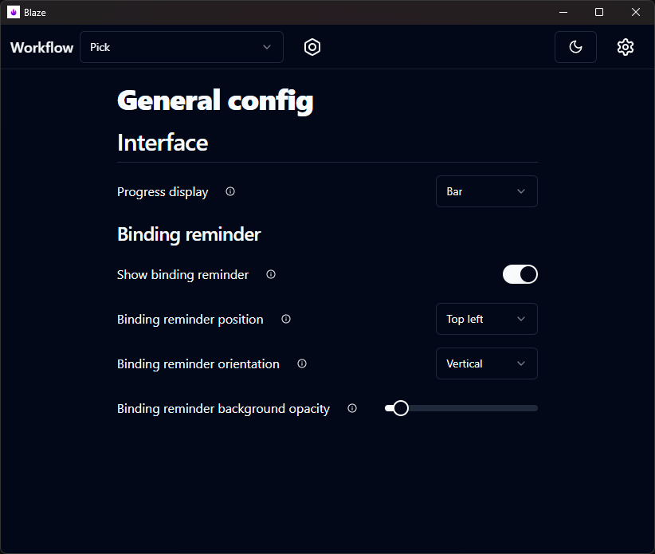
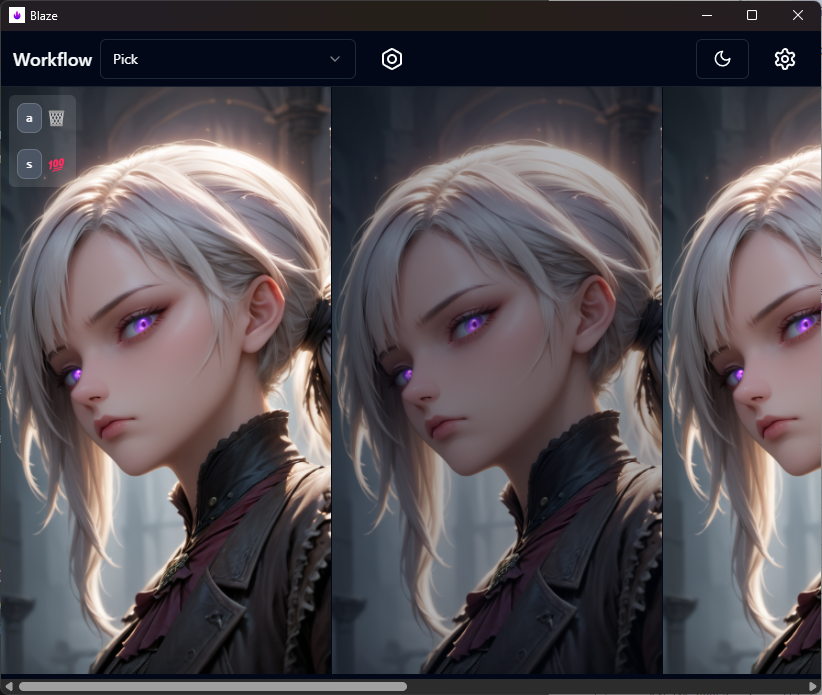

# Blaze - Image sorter

Blaze is a lightweight, minimalist application for sorting through large collections of images with as little effort as possible.
Likely usecases include sorting through images from photo-shoots or AI generated content

Currently has 2 modes:

- Sort - quickly go through all the images in a directory one-by-one, sending each image to the desired location/deleting it with a keypress

- Compare - view a group of related images at the same time and deal with each image.
  Grouping is based on filenames using regular expressions.

## Installation

Download the latest installer release from Github [here](https://github.com/sqooid/blaze/releases/latest).

## Screenshots

|                                                     |                                                     |
| :-------------------------------------------------: | :-------------------------------------------------: |
|  |  |
|  |  |
|  |  |

## Basic operation

1. Edit the default workflow by clicking the bolt icon
2. Configure bindings for various [actions](#actions)
3. Set a source directory where the images are located
4. Start sorting

### Actions

**Delete** - delete file (unrecoverable)

**Move** - move file to another directory

**Skip** - move file to the back of the queue

## Planned features

- Visual feedback on binding press
- Animation on next image
- Undo bind action
