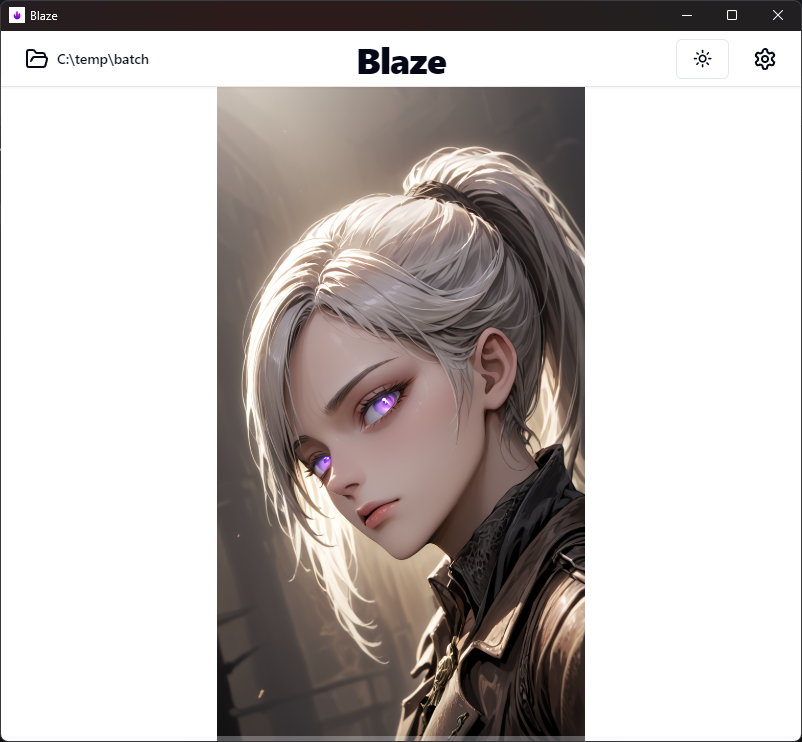
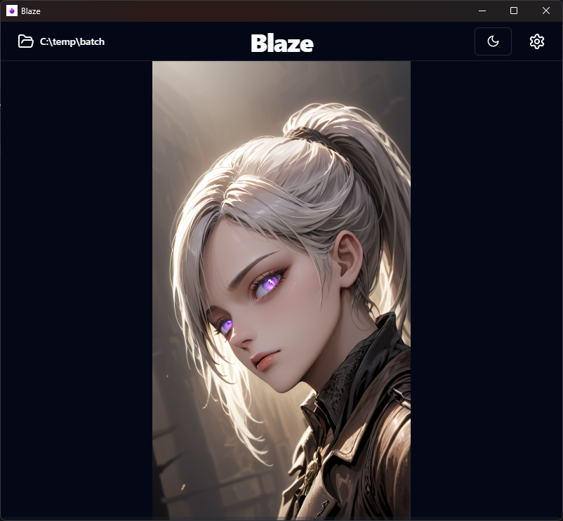
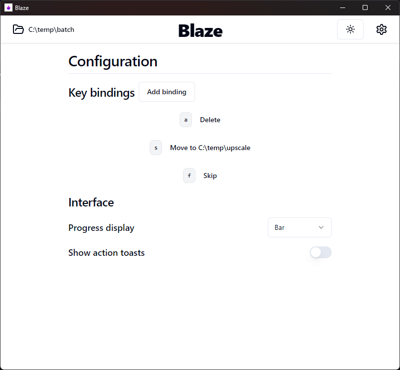
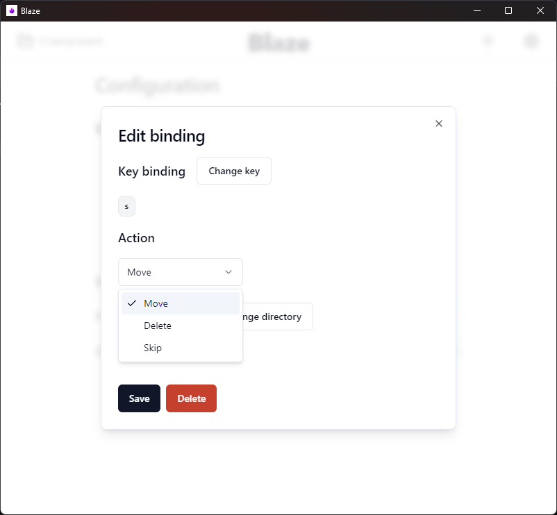

# Blaze - Image sorter

Blaze is a lightweight, minimalist application for sorting through large collections of images with as little effort as possible.
Likely usecases include sorting through images from photo-shoots or AI generated content

## Installation

Download the latest installer release from Github [here](https://github.com/sqooid/blaze/releases/latest).

## Screenshots

## Basic operation

1. Choose a source directory where images will be read from
2. Configure bindings for various [actions](#actions)
3. Configure other interface settings as desired
4. Start sorting

### Actions

**Delete** - delete file (unrecoverable)

**Move** - move file to another directory

**Skip** - move file to the back of the queue

## Planned features

- Image preloading (useful for network drives)
- Show bindings on sorter with icons
- Visual feedback on binding press
- Animation on next image
- Undo bind action
